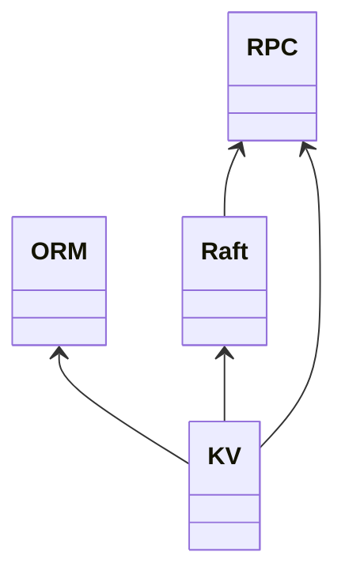
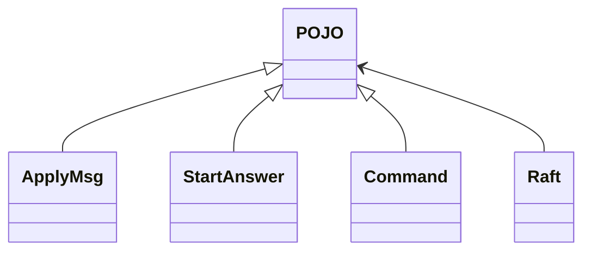
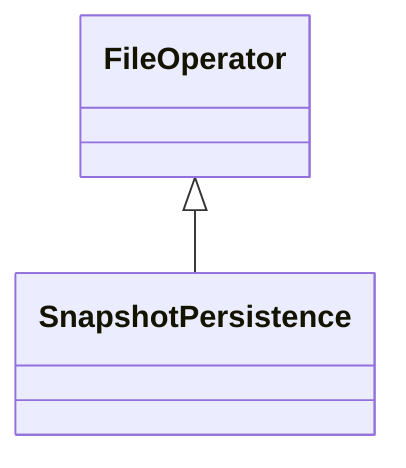

# 说明
lab2实现的Raft协议，可以保证一个服务器集群达成共识，而本实验则是通过lab2的共识算法实现一个分布式的KV数据库。
# 模块设计
共有两个项目，一个是建立在Raft上的KV server，一个是Clerk，即客户端
## KV server
分为四个大模块，分别是KV、ORM、Raft、RPC，RPC进一步封装rpc通信接口，Raft模块负责与Raft系统通信，ORM模块负责在snapshot时将kv数据持久化，KV模块是依赖于前三个模块的在逻辑上完成KV数据库功能的模块。

RPC是一个单类，不必赘述，其他模块将详细介绍
### Raft
Raft 使用start和apply的接口完成与raft系统的通信，其中POJO是通信单元类的父类，其子类是通信过程中的参数/返回值

### ORM
ORM模块中父类完成文件的物理读写操作，子类完成逻辑读写操作，此模块中使用boost提供的序列化工具完成。在本项目中物理读写和逻辑读写差别不大，但是为了逻辑更为清晰，仍对其区分。

### KV
模块中只有KVserver类，是本项目的核心，其对外提供三个方法，`acceptCommand`、`snapshot`、`execute`，`acceptCommand`方法是从Clerk端接收命令，并丢给Raft，`snapshot`和`execute`方法是由Raft系统调用的，当Raft系统收到apply的命令时，在Raft模块中整理命令（包括去重等），并根据情况调用KVserver的方法。

TODO:
通过检测apply的command是否由leader发出，实现读操作的exactly one，否则所有的kvServer均返回
## Clerk
Clerk模块提供四个接口`put`, `append`, `aget`, `getData`，其中前三个接口由本地调用，完成的任务都是异步的，只是将Command封装好，然后丢给KVserver，`getData`则是由KVserver执行命令时调用的。通过`aget`和`getData`，使用同步信号量可以实现同步的`get`接口。

# 核心类接口
## KVserver
```c++
class KVserver
{
	map<string, string> data;
	SnapshotPersistence snapshotPersistence;
	Raft* raft;
	NetWorkAddress raftServerAddress;
	RPC rpc;
	// 打印调试信息的开关
	bool debug;
	void setDebug();
	// 给Clerk开放的接口
	int acceptCommandPort;
	// 注册接收Clerk调用的函数
	void registerAcceptCommand();
	// Clerk accept command 跑的线程
	thread* acceptCommandThread;
	// print the data in kv server
	void printState() const;
public:
	KVserver(NetWorkAddress raftServerAddress, int applyMsgPort = 8001, int acceptCommandPort = 8011, string snapshotFilePath = "snapshot.data");
	~KVserver();
	// 真正执行命令，由Raft调用
	void execute(const Command& command);
	// 写快照，由Raft调用
	void snapshot();
	// 接收命令，丢给Raft系统
	int acceptCommand(rpc_conn conn, const Command& command);
};
```
## Raft
```c++
class Raft
{
	// 连接raft集群的地址
	NetWorkAddress raftServerAddress;
	// 接收applyMsg的端口号
	int applyMsgPort;
	// 命令集
	vector<Command> commands;
	// 最近被commit的命令下标
	int commitedIndex;
	// 接收applyMsg的线程
	thread* applyMsgThread;
	// debug标志位
	bool debug;
	// applyMsg锁，保证系统状态不被并行修改（commands、commitedIndex）
	mutex stateLock;

	// KV数据库指针
	KVserver* kvServer;

	// 执行到newCommitIndex
	void execute(int newCommitIndex);
	// 写快照
	void snapshot(int snapshotIndex);
	// 更新命令，比较新命令和原有命令的区别，若不同则覆写并更新commitedIndex，commitedIndex = min(commitedIndex, the first index is different from new commands)
	void updateCommands(vector<Command> newCommands);
	// 注册接收返回commit信息的函数
	void registerApplyMsg();
	// 开启调试信息
	void setDebug();

	
public:
	Raft(NetWorkAddress raftServerAddress, int applyMsgPort, KVserver* kvServer);
	~Raft();
	// 向Raft系统发送命令,阻塞函数，需要等待返回值
	StartAnswer start(Command command);
	// 接收Raft系统的applyMsg信息
	void applyMsg(rpc_conn conn, ApplyMsg applyMsg);
};
```
## Clerk
```c++
class Clerk
{
	NetWorkAddress kvServerAddress;
	RPC rpc;
	int invokeCommand(Command command);
	// 返回数据的地址
	NetWorkAddress getDataAddress;
	thread* getDataThread;
	// 注册getData函数
	void registerGetData();
public:
	Clerk(NetWorkAddress kvServerAddress, NetWorkAddress getDataAddress);
	~Clerk();
	void put(string key, string value);
	void append(string key, string value);
	// 返回数据调用接口
	void getData(rpc_conn conn, int commandID, string value);
	// 异步的get，返回commandID
	int aget(string key);
};
```