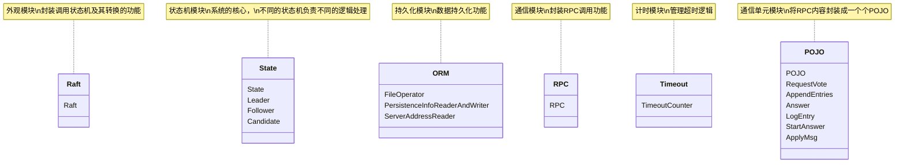
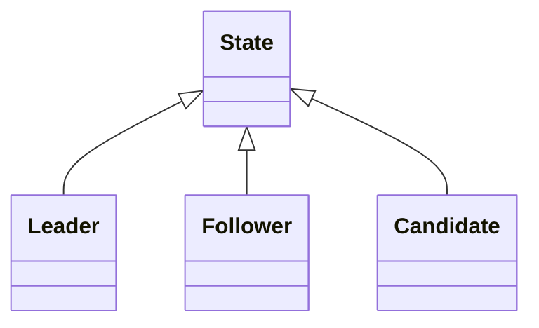
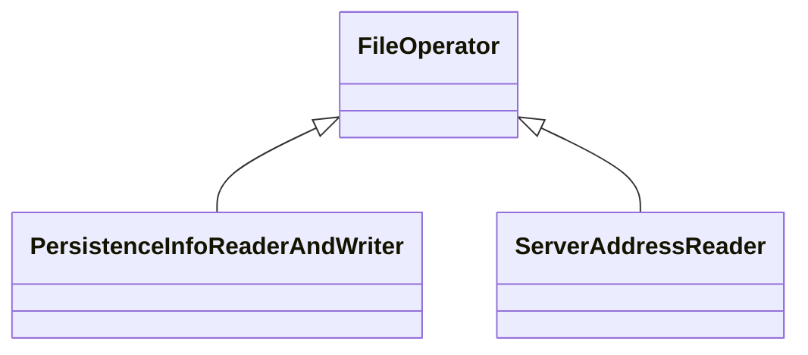
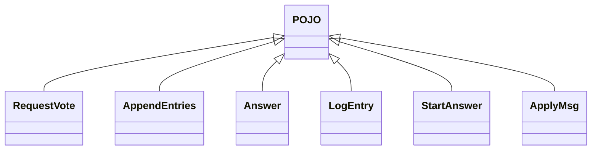
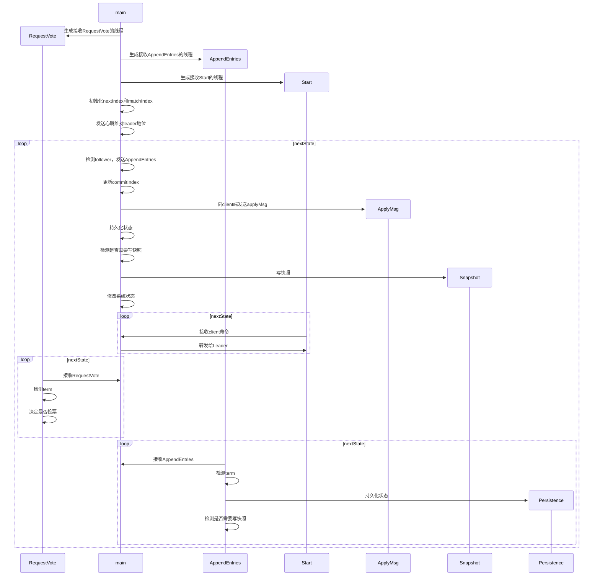
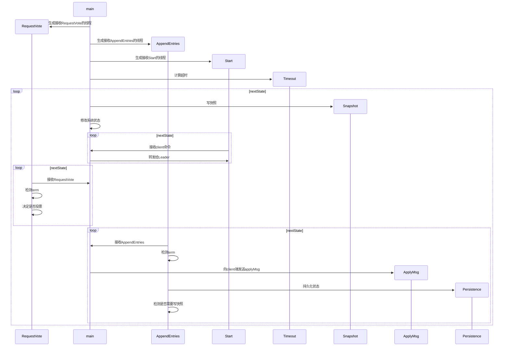
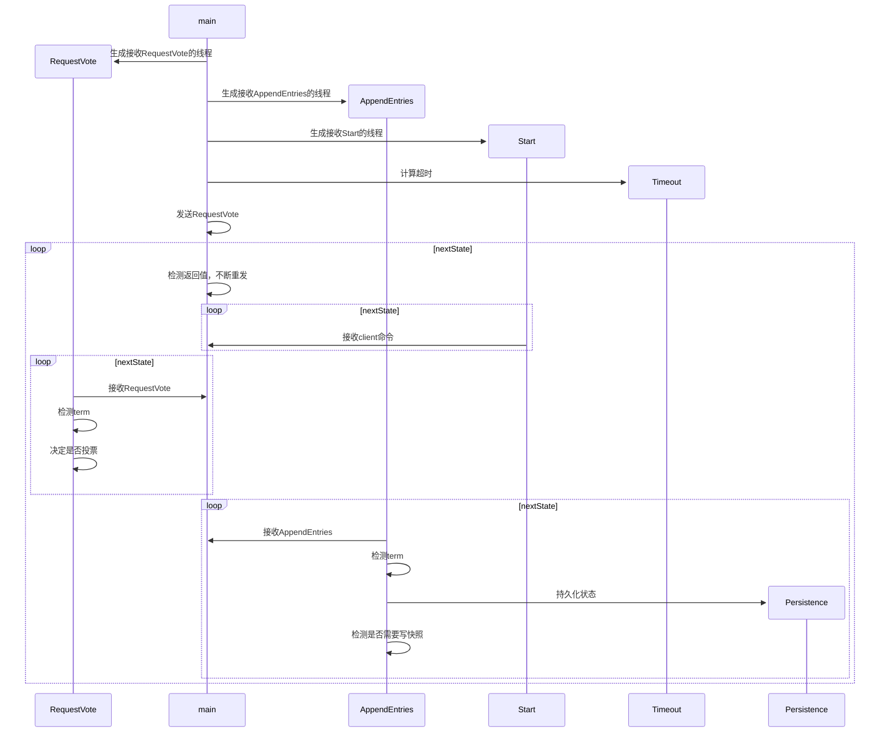

# 模块划分与对应类
整个系统分为五个模块，分别是通信模块、外观模块、计时模块、状态机模块、持久化模块以及通信单元POJO模块。
通信模块封装RPC调用功能，外观模块封装调用状态机及其转换的功能，计时模块负责管理超时逻辑，状态机模块是整个系统的核心，不同的状态机负责不同的逻辑处理，持久化模块负责持久化功能，通信单元POJO模块将RPC内容封装成一个个POJO。

## State 模块
State定义run、appendEntries、requestVote、start接口，各个子类状态机实现这些接口

## ORM 模块
ORM模块的父类FileOperator实现底层的文件操作，子类实现逻辑持久化

## POJO 模块
POJO模块的父类POJO实现编码操作，方便持久化，但是实际上并没有经常用到，因为序列化转成了官方提供的接口

# 相关线程
## Leader
Leader 的任务包括
1. 接收client端/其他follower转发的命令（start）
2. 回应client端（applyMsg）
3. 发送 appendEntries
4. 接收 appendEntries
5. 接收 RequestVote
6. 根据现有命令数量发起snapshot
7. 持久化状态

因此，Leader的线程会包括：

## Follower
Follower 的任务包括
1. 接收client端的命令，并转发给follower（start）
2. 回应client端（applyMsg）
3. 接收appendEntries
4. 接收RequestVote
5. 持久化状态
6. 超时进程计算

## Candidate
Candidate 的任务包括
1. 接收client端的命令，并转发给follower（start）
2. 超时进程计算
3. 接收 appendEntries
4. 接收 RequestVote
5. 发送 RequestVote

# 核心类的接口
## State
```c++
class State
{
	// 接收句柄数量
	int handleNum;
protected:
	/*需要持久化的state*/
	//server所处的term，也是该server所得知的最新term
	int currentTerm;
	//如果是-1，则该term内尚未投票，如果是candidateID，则该term中的选举已经投票给了该candidate
	int votedFor;
	// 当前server的所有log entries，每一条log entry包含命令和term编号
	vector<LogEntry> logEntries;

	/*从配置或启动命令中读入*/
	//状态机id
	int ID;

	/*其实只需要port，有时间将接口改了*/
	// 状态机用于接收start的ip和port
	NetWorkAddress startAddress;
	// 状态机用于接收appendEntries的ip和port
	NetWorkAddress appendEntriesAddress;
	// 状态机用于接收requestVote的ip和port
	NetWorkAddress requestVoteAddress;
	// 集群中各服务器的地址(leader用于发送AppendEntries，candidate用于发送requestVote，follower用于转发请求)
	map<int, NetWorkAddress> serverAddress;
	// 状态机用于发送applyMsg的地址
	NetWorkAddress applyMessageAddress;


	/*易失状态，不需要持久化*/
	//最大的已经commit的log entries index
	int commitIndex;
	//最新加入的log entries index
	int lastApplied;
	
	/*运行过程中需要用到的变量*/
	
	// AppendEntries线程
	thread* appendEntriesThread;
	// RequestVote线程
	thread* requestVoteThread;
	// 接收start信息的线程指针
	thread* startThread;

	/*控制线程的智能指针*/
	// 用于控制接收AppendEntries线程
	unique_ptr<rpc_server> startRpcServer;
	// 用于控制接收AppendEntries线程
	unique_ptr<rpc_server> appendEntriesRpcServer;
	// 用于控制接收RequestVote线程
	unique_ptr<rpc_server> requestVoteRpcServer;

	// 下一个状态，非空说明要进入下一个状态了，马上跳出循环，stop
	State* nextState;
	// 接收信息的大锁，进程中同时仅允许处理一条接收的信息，包括appendEntries和requestVote
	mutex receiveInfoLock;
	// 发送rpc信息
	RPC rpc;

	// 注册三个服务
	void registerServer();
	// 注册start函数
	void registerStart();
	// 注册start函数句柄
	virtual void registerHandleStart() = 0;
	// 注册等待接收AppendEntries
	void registerAppendEntries();
	// 注册等待接收AppendEntries句柄
	virtual void registerHandleAppendEntries() = 0;
	// 注册投票线程RequestVote
	void registerRequestVote();
	// 注册投票线程RequestVote句柄
	virtual void registerHandleRequestVote() = 0;
	
	// 添加entries，返回值表示是否成功添加
	bool appendEntriesReal(int prevLogIndex, int prevLogTerm, int leaderCommit, vector<LogEntry> entries);
	// 主线程 leader和candidate发东西，follower守护
	virtual void work() = 0;

	// debug输出开关
	bool debug;
	// 打印状态信息
	void printState();

	// 模拟服务器挂掉
	bool crush(double rate) const;

	// 持久化
	void persistence() const;


	// 快照对系统状态的改变
	void snapShotModifyState(int snapshotIndex);
	// 发送更新的commit信息，异步通知上层应用
	void applyMsg(bool snapshot = false, int snapshotIndex = -1);
public:
	// 构造函数完成初始化两个接收线程和计时器线程的任务
	State(int currentTerm, int ID, NetWorkAddress appendEntriesAddress,NetWorkAddress requestVoteAddress, 
		NetWorkAddress startAddress, NetWorkAddress applyMessageAddress, int commitIndex, int lastApplied, vector<LogEntry> logEntries, int votedFor = -1, int handleNum = 10);
	// 析构函数完成线程join和delete掉线程对象的任务
	virtual ~State();

	// 开启debug模式
	void setDebug() { debug = true; };
	// 获取当前currentTerm
	int getCurrentTerm() const;

	// start调用，leader和candidate添加一条新的entries，follower转发给leader
	virtual StartAnswer start(rpc_conn conn, string command);

	// 等待接收AppendEntries
	virtual Answer appendEntries(rpc_conn conn, AppendEntries appendEntries) = 0;

	// 投票线程RequestVote
	virtual Answer requestVote(rpc_conn conn, RequestVote requestVote) = 0;

	// 运行该机器，返回值是下一个状态
	virtual State* run();
};
```
## Leader
```c++
class Leader : public State
{
	// 需要发给每一个follower的下一条log entry（初始化值是leader的最后一个log entry的下一个值）
	map<int, int> nextIndex;
	// 每个follower当前匹配到哪一条log entry（初始化值为0）
	map<int, int> matchIndex;
	
	// 用于异步接收心跳/返回值的future
	map<int, vector<shared_future<Answer>>> followerReturnVal;
	// 用于异步接收snapshot的future
	map<int, vector<shared_future<Answer>>> snapshotReturnVal;
	// 最大重发次数
	int maxResendNum;
	// 快照阈值
	int snapshotThreshold;

	// 记录上一个包，方便重发
	map<int, AppendEntries> lastAppendEntries;
	map<int, AppendEntries> snapshotLastAppendEntries;

	

	

	// 主线程：检测 发送appendEntries commit
	void work();
	// 更新commitIndex
	void updateCommit();

	/*主线程的任务，快照复用了这部分函数*/
	// 检测所有follower，重发或新发包
	void checkFollowers();
	// 检查单个follower，若成功则true，若不成功则尝试重发
	bool checkOneFollowerReturnValue(int followerID, bool snapshot = false);
	// 获取单个follower的返回值
	Answer getOneFollowerReturnValue(int followerID);

	// 给指定ID的follower发送appendEntries，内容为本状态机的[start,end]的内容，若start<0则为空的心跳信息(组装好AppendEntries)
	void sendAppendEntries(int followerID, int start, int end, bool snapshot = false, int snapshotIndex = -1);
	// 发指定follower的包，返回值代表还能不能发包（拿一步的AppendEntries重发）
	bool sendAppendEntries(int followerID, bool snapshot = false);

	// 快照接口
	void snapshot();
	// 阻塞，通知follower写快照
	void informSnapshot(int snapshotIndex);
	// 快照对系统状态的改变
	void snapShotModifyState(int snapshotIndex);

	/*虚函数注册不同的句柄*/
	// 注册等待接收AppendEntries句柄
	void registerHandleAppendEntries();
	// 注册投票线程RequestVote句柄
	void registerHandleRequestVote();
	// 注册start函数句柄
	void registerHandleStart();

	
public:
	Leader(int currentTerm, int ID, NetWorkAddress appendEntriesAddress, NetWorkAddress requestVoteAddress,
		NetWorkAddress startAddress, NetWorkAddress applyMessageAddress, int commitIndex, int lastApplied, 
		vector<LogEntry> logEntries, int votedFor = -1, int maxResendNum = 3, int snapshotThreshold = 10);
	// 析构函数完成线程join和delete掉线程对象的任务
	~Leader();
	// 接收RequestVote
	Answer requestVote(rpc_conn conn, RequestVote requestVote);
	// 接收AppendEntries
	Answer appendEntries(rpc_conn conn, AppendEntries appendEntries);
};
```
## Follower
```c++
class Follower : public State
{
	// 用于计算超时的类
	TimeoutCounter timeoutCounter;
	// 计时器线程
	thread* timeoutThread;
	// 计算超时的线程，结束时会把其他几个接收线程都退出，所以如果想要结束当前所有线程，可以调用结束计时器的函数
	void timeoutCounterThread();

	// 记录leaderID
	int leaderID;
	// 比较传入记录和自己哪个更新
	bool isNewerThanMe(int lastLogIndex, int lastLogTerm) const;
	// 重载统一接口，在follower里面就是一个守护线程
	void work();

	// 注册等待接收AppendEntries句柄
	void registerHandleAppendEntries();
	// 注册投票线程RequestVote句柄
	void registerHandleRequestVote();
	// 注册start函数句柄
	void registerHandleStart();
public:
	Follower(int currentTerm, int ID, NetWorkAddress appendEntriesAddress, NetWorkAddress requestVoteAddress,
		NetWorkAddress startAddress, NetWorkAddress applyMessageAddress, int commitIndex, int lastApplied, vector<LogEntry> logEntries,
		int votedFor = -1);
	~Follower();
	// 重载start调用,转发给leader
	StartAnswer start(rpc_conn conn, string command);
	// 接收RequestVote
	Answer requestVote(rpc_conn conn, RequestVote requestVote);
	// 接收AppendEntries
	Answer appendEntries(rpc_conn conn, AppendEntries appendEntries);
};
```
## Candidate
```c++

class Candidate : public State
{

	// 用于计算超时的类
	TimeoutCounter timeoutCounter;
	// 计时器线程
	thread* timeoutThread;
	// 计算超时的线程，结束时会把其他几个接收线程都退出，所以如果想要结束当前所有线程，可以调用结束计时器的函数
	void timeoutCounterThread();

	// 投票结果 0:没有收到 1：赢得该选票 -1：输了
	map<int, int> voteResult;
	// 获得的选票数量
	int getVoteCounter;
	// 被拒绝的次数
	int rejectCounter;
	
	// 主线程：运行检测投票
	void work();
	// 检查发送的投票信息，返回值为true：都返回了 false：存在未返回的值
	bool checkRequestVote();
	// 根据当前信息，尝试发送requestVote，返回值表示是否发送成功
	bool sendRequestVote(int followerID);

	// 检查单个follower，若成功则true，若不成功则尝试重发
	bool checkOneFollowerReturnValue(int followerID, Answer& ans);


	// 检测投票结果，只有返回true时知道选举成功，返回false意味着未知数，选举失败靠appendEntries
	bool checkVoteResult();

	// 用于异步接收心跳/返回值的future
	map<int, vector<shared_future<Answer>>> followerReturnVal;
	// 最大的重发次数
	int maxResendNum;

	// 注册等待接收AppendEntries句柄
	void registerHandleAppendEntries();
	// 注册投票线程RequestVote句柄
	void registerHandleRequestVote();
	// 注册start函数句柄
	void registerHandleStart();
public:
	Candidate(int currentTerm, int ID, NetWorkAddress appendEntriesAddress, NetWorkAddress requestVoteAddress,
		NetWorkAddress startAddress, NetWorkAddress applyMessageAddress, int commitIndex, int lastApplied, vector<LogEntry> logEntries,
		int votedFor = -1, int maxResendNum = 3);
	~Candidate();
	// 接收RequestVote
	Answer requestVote(rpc_conn conn, RequestVote requestVote);
	// 接收AppendEntries
	Answer appendEntries(rpc_conn conn, AppendEntries appendEntries);

};
```
# 测试命令
`Raft.exe [appendEntriesAddress.ip] [appendEntriesAddress.port] [requestVoteAddress.ip] [requestVoteAddress.port] [startAddress.ip] [startAddress.port]`
